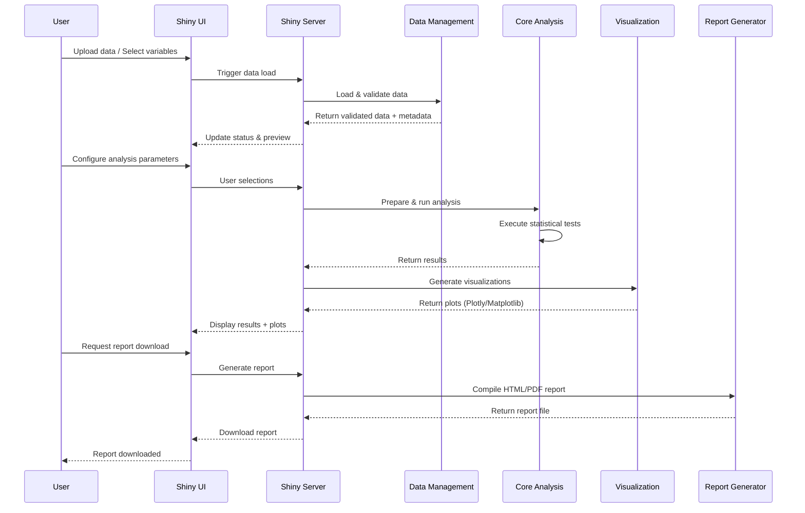
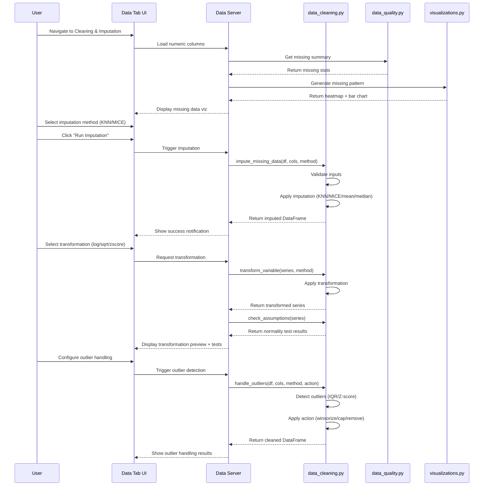
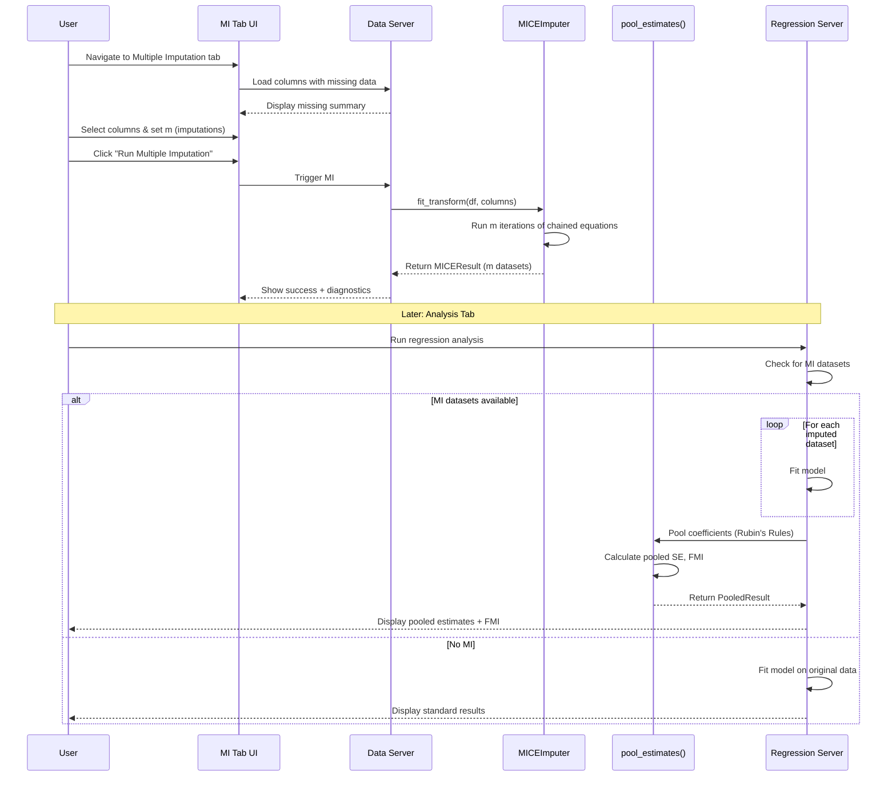
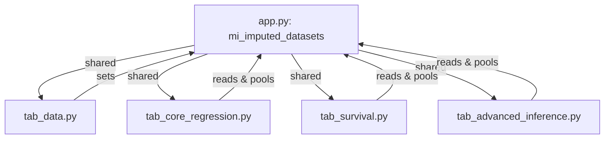
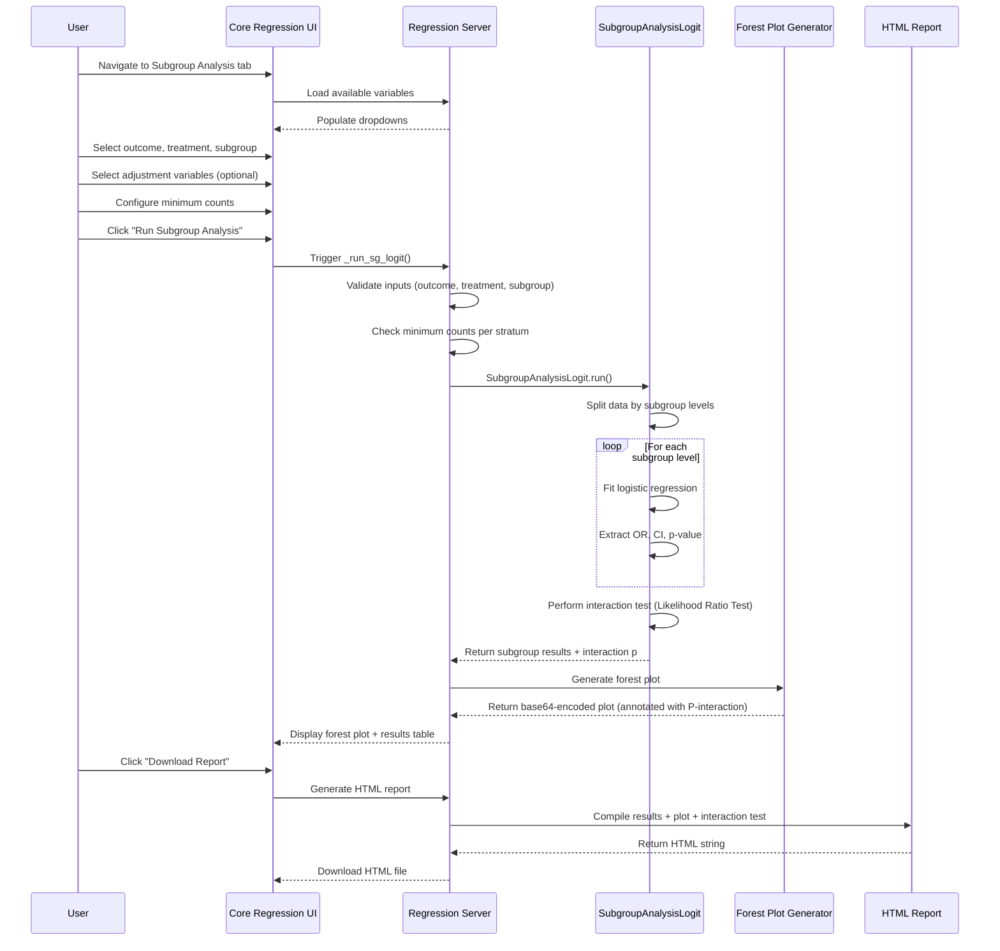
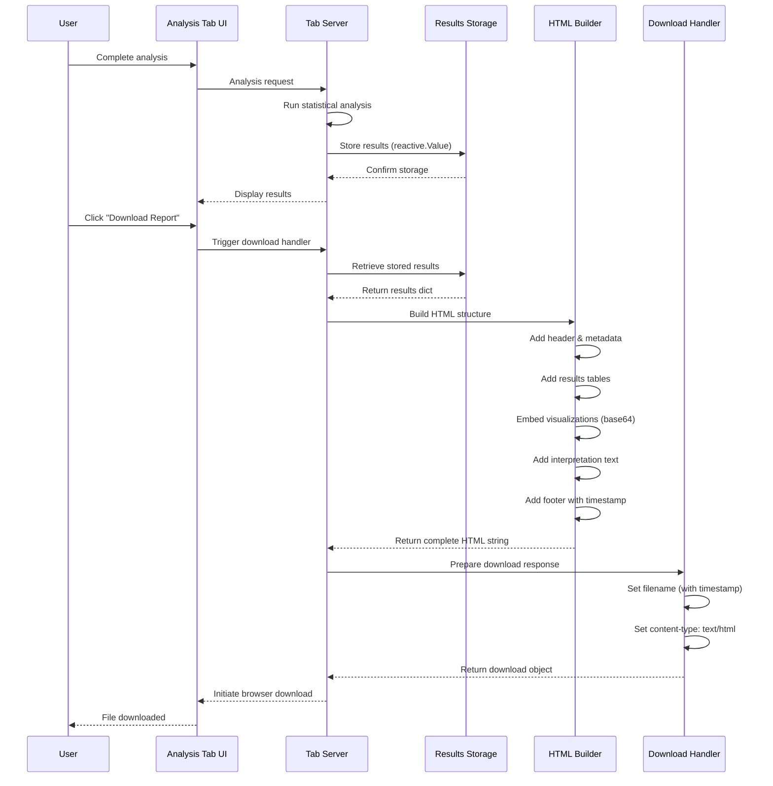
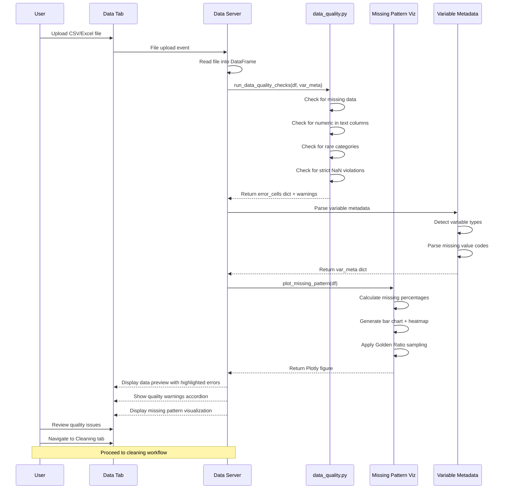

# 🏗️ System Architecture & AI Context

This document provides a deep technical overview of the **Medical Statistical Tool** for developers and AI agents (Antigravity/Bots).

---

## 📱 App Shell & Navigation

The application uses a fluid, multi-menu navbar designed for responsiveness and accessibility.

### Fluid UI & Layout

- **Container**: Built using `ui.page_fluid` for full-width flexibility across devices.
- **Navigation**: Utilizes nested `ui.page_navbar` and `ui.nav_menu` to organize 10+ statistical modules into logical groups (General Stats, Inference, etc.).
- **Accessibility**: Includes skip-links, ARIA landmarks, and standardized focus states.

### ⚡ Modular Structure

The application is built on a modular architecture where each tab is a self-contained component. While modules follow a common structure for consistency, they are fully initialized during the application startup to ensure immediate availability and a smooth user experience.

## 1. Overall Application Flow

## 2. Advanced Data Cleaning Workflow

## 2.5. Multiple Imputation Workflow (NEW)

## 2.6. Shared MI State Architecture

## 3. Logistic Regression Subgroup Analysis Workflow

## 4. Report Generation & Download Workflow

## 5. Data Quality Check & Validation Workflow

---

## 🎨 UI Styling System

The application uses a centralized styling system to ensure visual consistency across all modules.

### Core Components & Sync Workflow

| File | Role | Description |
| :--- | :--- | :--- |
| `tabs/_common.py` | **Source of Truth** | Defines the central `get_color_palette()` and common UI constants. |
| `tabs/_styling.py` | **CSS Generator** | Main injector that generates CSS using the palette from `_common.py`. |
| `static/styles.css` | **Compiled CSS** | Auto-generated output. **DO NOT EDIT DIRECTLY.** |
| `utils/update_css.py` | **Sync Utility** | Script to update `static/styles.css` whenever `_styling.py` changes. |

> [!TIP]
**To update styles**: Edit `tabs/_styling.py` then run:

- Unix/Linux/macOS: `.venv/bin/python utils/update_css.py`
- Windows: `.venv\Scripts\python.exe utils/update_css.py`

### Visual Consistency (Plotly & HTML)

- `utils/plotly_html_renderer.py`: Standardizes Plotly figure rendering (Inter font, theme-sync).
- `utils/formatting.py`: Handles P-value styling, logic-driven badges, and statistical report HTML structure (syncing with `config.py`).
  - **PublicationFormatter**: Provides per-journal templates (**NEJM, JAMA, Lancet, BMJ**) and automated "Methods" text generation.
  - **MissingDataStatement**: Generates standardized reporting on missingness handling.
- `utils/table_one_advanced.py`: **Advanced Table 1 Generator** (OOP). Handles intelligent variable classification and **Odds Ratio (OR) calculation**.
  - **Categorical OR**: Uses **2x2 Contingency Tables** comparing each level (or Target) against the **First Level (Reference)**. Applies **Haldane-Anscombe correction** (+0.5) for zero cells. Supports "All Levels" and "Simple" (Binary Target vs Ref) styles.
  - **Continuous OR**: Uses **Univariate Logistic Regression**.
- `utils/diagnostic_advanced_lib.py`: **Advanced Diagnostic Engine** (OOP) providing robust ROC analysis, **DeLong's Test**, and Wilson Score confidence intervals.
- `utils/agreement_lib.py`: **Agreement Analysis Engine** providing Cohen's/Fleiss' Kappa, advanced Bland-Altman (CI bands), and ICC.
- `utils/psm_lib.py`: **Propensity Score Engine**.
  - `PropensityScoreDiagnostics`: Handles **Common Support** assessment (distribution overlap stats) and **Love Plot** generation.
  - Implements **Inverse Probability Weighting (IPW)** with optional **Weight Truncation** (1st/99th percentiles).
- `utils/multiple_imputation.py`: **Multiple Imputation Engine** (MICE with Rubin's Rules).
  - `MICEImputer`: Generates m imputed datasets using `IterativeImputer` with `sample_posterior=True`.
  - `pool_estimates()`: Implements **Rubin's Rules** for pooling point estimates and standard errors.
  - **Auto-Pooling**: `tab_core_regression.py` automatically detects MI datasets and pools logistic regression results, reporting **Fraction of Missing Information (FMI)**.
  - Diagnostic plots: Density comparisons and imputation traces.
- `utils/effect_sizes.py`: **Effect Size Engine**. Calculates **Cohen's d, Hedges' g, η², ω²** with interpretation badges.
- `utils/sensitivity_lib.py`: **Sensitivity Analysis**. Implements **Bootstrap CI**, **Jackknife**, and **LOO-CV**.
- `utils/statistical_assumptions.py`: **Assumption Testing**. Centralized normality and homogeneity variance tests.

### Dynamic UI Enhancements (Animations)

- **Fade-in Entry**: All statistical results utilize a smooth fade-in animation to improve user experience.
- **Logic**: Defined in `tabs/_styling.py` as the `.fade-in-entry` class, providing a 0.4s ease-out entry with a subtle upward translate.
- **Standardized Wrapper**: The `create_results_container` utility in `utils/ui_helpers.py` has been updated to support these animations via the `class_` parameter.

---

## 📊 Analysis Modules

The application covers a wide range of medical statistical needs, organized into functional clusters:

| Category | Modules | Key Features |
| :--- | :--- | :--- |
| **Standard** | `tab_corr`, `tab_diag`, `tab_agreement` | Multi-method Correlation (**Kendall/Spearman/Pearson**), **ROC/AUC** (Youden/F1/Calibration), **Paired DeLong Test**, **Sens/Spec vs Threshold**, **Agreement** (Cohen's/Fleiss' Kappa, Bland-Altman with CI bands, ICC with interpretation). |
| **Inference** | `tab_core_regression`, `tab_advanced_inference` | Linear/Logistic/Cox Regressions (**Firth/Deep Diagnostics**), **Subgroup analysis** (Logistic/Cox), Forest Plots. |
| **Causal** | `tab_causal_inference`, `tab_baseline_matching` | EconML Integration, Propensity Score Matching (PSM), Covariate Balance (Love Plots: Green <0.1, Yellow 0.1–0.2 (Red: >0.2, not rendered)), Common Support Visualization. |
| **Specialized** | `tab_survival`, `tab_advanced_stats`, `tab_sample_size` | Kaplan-Meier, **Extended Diagnostics** (Schoenfeld/Martingale/Deviance), Time-Varying Cox (with Interaction Check), G-Computation, Power Analysis. |

---

## 🔄 Data Processing & Statistical Pipeline

The data flow is standardized to ensure consistent handling of missing values and variable metadata.

### 1. Ingestion & Quality Check (`tab_data.py` & `utils/data_quality.py`)

- Users upload files (CSV/Excel) or load example data.
- **Immediate Data Health Report**: Uses `check_data_quality()` and the `DataQualityReport` class to perform deep validation:
  - **Numeric Validation**: Detects non-standard values like `"<5"`, `"10%"`, or symbols (`<`, `>`, `,`, `%`, `$`, `€`, `£`), among others.
  - **Categorical Validation**: Identifies numbers accidentally placed in categorical columns and flags rare categories.
  - **Data Quality Scorecard**: A structured report with 4 dimension scores (Completeness, Consistency, Uniqueness, Validity) displayed via Value Boxes.
  - **Detailed Diagnostic Log**: Provides a **complete list** of row indices for issues, serving as the full "Error Log".
- **Configuration**: Individual variable type casting and missing value strategy selection based on the health report.

### 2. **Configuration & Cleaning**

- **Interactive Setup**: Users interactively cast variable types and choose missing value strategies.
- **Advanced Cleaning**: Users can apply Imputation (KNN/MICE), handle Outliers (Winsorize/Cap), and Transform variables (Log/Sqrt) directly within the UI.
- **UI Standardization**: Recent updates have unified the "Variable Selection" UI across modules (e.g., Table 1, Survival Analysis, Regression), utilizing full-width Selectize inputs with "remove button" plugins for better usability. Action buttons are also standardized to full-width (`w-100`) for consistent click targets.

### 3. Multiple Imputation (`utils/multiple_imputation.py`) [NEW]

- **Purpose**: Handles missing data properly using **Multiple Imputation by Chained Equations (MICE)** with **Rubin's Rules** for pooling.
- **Auto-Integration**: When MI is enabled in the Data Management tab, imputed datasets are automatically used in regression analyses.
- **Key Components**:
  - **MICEImputer**: Generates m imputed datasets (default m=5).
  - **Rubin's Rules**: Combines within-imputation and between-imputation variance for valid inference.
  - **Fraction of Missing Information (FMI)**: Reported to indicate missingness impact on each estimate.

### 4. Central Preparation (`utils/data_cleaning.py`)

- **Before Analysis**: Data is passed through `prepare_data_for_analysis()` which handles exclusion logic and logging.
- **Outlier Logic**: `handle_outliers()` supports 'iqr' and 'zscore' detection with 'remove', 'winsorize', or 'cap' actions.

### 5. Integrated Reporting (`utils/formatting.py`)

- **Missing Data Statistics**: Automatically analyzed and included in the final report.
  - **Smart Visualization Sync**: The report is architected to be the "detailed companion" to the visualization, covering "blind spots" if the heatmap is subsampled.
  - **Diagnostic Metrics**: Multi-metric reports follow a "Table 2" publication-grade layout (Metric, Value, 95% CI, Interpretation).
  - **Logistic Regression**: Deep diagnostics (AUC/C-stat, Hosmer-Lemeshow, AIC/BIC)
  - **Subgroup Analysis**: Formal Interaction Tests (Likelihood Ratio Test) and Forest Plots annotated with P-values.
  - **Evidence-Based Badges**: Logic-driven badges (Landis-Koch, Cicchetti, EBM standards for LR) and **STROBE/TRIPOD alignment text** provide immediate clinical and reporting context.
  - **Outcome**: A standardized "Missing Data Summary" and localized interpretation guides are automatically included.

---

## 🧪 Testing & Quality Assurance

### Continuous Integration (CI)

- `.github/workflows/quality_check.yml`: Runs the full suite of Unit, Integration, and E2E (Playwright) tests.
- `.github/workflows/ui-styling.yml`: Verifies CSS/JS/Python styling consistency.
- `.github/workflows/docker-publish.yml`: Automates production image builds.

### Test Suites

- **Unit**: Core utilities, statistics math, color palette.
- **Integration**: PSM pipelines, data cleaning flow.
- **E2E**: Multi-tab navigation, smart variable defaults, loading states.

---

> [!NOTE]
> **AI AGENT GUIDANCE**: When adding new features:
>
> 1. Verify UI components use `get_color_palette()`.
> 2. Ensure all data-heavy modules call `prepare_data_for_analysis()`.
> 3. Add tests to the corresponding suite in `tests/`.
