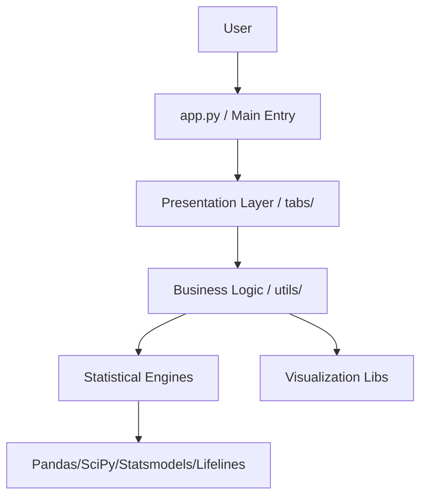

นี่คือไฟล์ Markdown (`.md`) ที่ถูกจัดรูปแบบให้ตรงกับโครงสร้างและเนื้อหาในไฟล์ PDF ต้นฉบับที่คุณแนบมา โดยมีการใช้ Mermaid Diagram สำหรับแผนภาพ Architecture และจัดรูปแบบตาราง/Code block ให้สวยงามตามมาตรฐาน Markdown ครับ

```markdown
# 📊 Medical Stat Tool - Master Optimization & Development Plan

**Document Version:** 3.2 (Single-File Embedded HTML Edition)  
**Date:** January 24, 2026  
**Status:** Production-Ready (Execution Phase)  
**Target:** Enterprise-Grade / Interactive Reporting Standard

---

## 📑 Table of Contents

1. [Executive Summary](#1-executive-summary)
2. [Current Architecture & Health](#2-current-architecture--health)
3. [Module Optimization Roadmap](#3-module-optimization-roadmap-tiers-1-4)
4. [Deep Dive: Critical Technical Implementations](#4-deep-dive-critical-technical-implementations)
5. [Quality Assurance & Validation Strategy](#5-quality-assurance--validation-strategy)
6. [Documentation & Publication Standards](#6-documentation--publication-standards)
7. [DevOps, Deployment & Maintenance](#7-devops-deployment--maintenance)
8. [Project Management & Timeline](#8-project-management--timeline)

---

## 1. Executive Summary

The Medical Stat Tool (stat-shiny) is a comprehensive Python Shiny application designed for professional medical statistics. Currently comprising 15 modules and 28 utility libraries, the system is robust but requires targeted optimization to meet interactive reporting standards.

### Strategic Focus
* **Target:** Achieve >80% code coverage and exact numerical matches with R/SAS.
* **HTML-First Export Strategy:** Prioritize standalone, single-file HTML reports (**Embedded**). All reports must be self-contained (no external dependencies required for viewing) to ensure portability across devices (iPad, Mobile, Desktop).
* **Critical Path:** Prioritize "Big 4" modules: Regression, Survival, Baseline Table, Diagnostics.

---

## 2. Current Architecture & Health

### 2.1 System Overview
The application follows a modular Shiny architecture.



### 2.2 Critical Issues Identified

| Severity | Module | Issue | Impact |
| --- | --- | --- | --- |
| 🔴 **Critical** | **Core Regression** | Monolithic file (3,700 lines), mixed UI/Logic | Hard to maintain, untestable |
| 🔴 **Critical** | **Survival** | Missing PH assumption checks, TVC validation | Risk of statistical errors |
| 🟡 **High** | **Table 1** | Inconsistent decimal formatting, limited export | Not publication-ready |
| 🟡 **High** | **Diagnostics** | Missing ROC CI bands, Calibration plots | Limited clinical utility |

---

## 3. Module Optimization Roadmap

### 🔴 TIER 1: CRITICAL (Immediate Action - Weeks 1-4)

#### A. Core Regression Refactoring (`tab_core_regression.py`)

* **Objective:** Split monolithic file into MVC pattern.
* **Action Items:**

1. Create `utils/_core_regression_logic.py` for pure statistical functions.
2. Create `tabs/_core_regression_ui.py` for Shiny UI components.
3. Implement precise error handling (e.g., `SingularMatrixError`).
4. **Export:** Generate Single-File HTML Model Summary embedding residual plots and coefficient tables.

#### B. Survival Analysis Validation (`tab_survival.py`)

* **Objective:** Validate against R survival package.
* **Action Items:**

1. Implement Schoenfeld residuals test.
2. Validate TVC data transformation.
3. **Export:** Generate Interactive HTML Survival Report containing embedded Kaplan-Meier curves (Zoomable) and Risk Tables.

#### C. Baseline Table & Matching (`tab_baseline_matching.py`)

* **Objective:** Interactive Table 1.
* **Action Items:**

1. Standardize decimals.
2. Add Wilcoxon rank-sum and Fisher's exact test.
3. **Export:** Create Self-contained HTML Table using Bootstrap styling for clean, copy-paste ready tables.

#### D. Diagnostic Tests (`tab_diag.py`)

* **Objective:** Comprehensive model evaluation.
* **Action Items:**

1. Add 95% Confidence Intervals for ROC Curves.
2. Implement DeLong’s test.
3. **Export:** Generate Interactive Diagnostic Dashboard (HTML) combining ROC, DCA, and Calibration plots in one single file.

### 🟡 TIER 2: HIGH PRIORITY (Weeks 5-6)

* **Static Exports (Word/Excel/PDF):** Implement `python-docx` and `xlsxwriter` for manuscript submission formats.
* **Causal Inference:** Add IPW diagnostic plots.
* **Data Management:** Add KNN Imputation.

### 🟢 TIER 3: MEDIUM PRIORITY (Weeks 7-8)

* **Advanced Inference:** Complete Mediation Analysis.
* **Sample Size:** Add non-inferiority trial calculation.

---

## 4. Deep Dive: Critical Technical Implementations

### 4.1 Advanced Single-File HTML Embedding Utility

This utility uses Embedding (not iFrames) to ensure the report is truly portable. It injects CSS for styling and Plotly JS for interactivity directly into the document structure.

```python
# utils/export_html.py
import plotly.io as pio
import pandas as pd
from datetime import datetime

def generate_embedded_html_report(title, sections):
    """
    Generates a high-quality, single-file HTML report.
    Args:
        title (str): Report title.
        sections (list of dict): Content blocks.
        Example: [{'type': 'text', 'content': '...'}, 
                  {'type': 'plot', 'content': fig}, 
                  {'type': 'table', 'content': df}]
    """
    # 1. Header with Bootstrap CDN for instant professional styling
    html_content = f"""
    <!DOCTYPE html>
    <html lang="en">
    <head>
        <meta charset="UTF-8">
        <meta name="viewport" content="width=device-width, initial-scale=1.0">
        <title>{title}</title>
        <link href="https://cdn.jsdelivr.net/npm/bootstrap@5.3.0/dist/css/bootstrap.min.css" rel="stylesheet">
        <script src="https://cdn.plot.ly/plotly-latest.min.js"></script>
        <style>
            body {{ background-color: #f8f9fa; padding: 40px; }}
            .report-container {{ background: white; padding: 30px; border-radius: 8px; box-shadow: 0 4px 6px rgba(0,0,0,0.1); }}
            .section-title {{ border-bottom: 2px solid #007bff; padding-bottom: 10px; margin-top: 30px; color: #007bff; }}
            .footer {{ margin-top: 50px; font-size: 0.8em; color: #6c757d; text-align: center; }}
        </style>
    </head>
    <body>
        <div class="report-container">
            <h1 class="text-center mb-4">{title}</h1>
            <hr>
    """
    
    # 2. Iterate through content and Embed
    for section in sections:
        if section['type'] == 'header':
            html_content += f"<h3 class='section-title'>{section['content']}</h3>"
        elif section['type'] == 'text':
            html_content += f"<p>{section['content']}</p>"
        elif section['type'] == 'table':
            # Embed DataFrame as Bootstrap Table
            if isinstance(section['content'], pd.DataFrame):
                html_content += section['content'].to_html(classes='table table-striped table-hover', index=False)
        elif section['type'] == 'plot':
            # Embed Plotly Figure (Full HTML=False keeps just the div)
            plot_div = pio.to_html(section['content'], full_html=False, include_plotlyjs=False)
            html_content += f"<div class='plot-container'>{plot_div}</div>"

    # 3. Footer & Close
    html_content += f"""
            <div class="footer">
                Generated by Medical Stat Tool on {datetime.now().strftime('%Y-%m-%d %H:%M:%S')}
            </div>
        </div>
    </body>
    </html>
    """
    return html_content

```

### 4.2 Health Check Script

Implement this for production monitoring.

```python
# monitoring/health_check.py
import subprocess
import json
from datetime import datetime

def run_health_check():
    report = {"timestamp": datetime.now().isoformat(), "status": "healthy"}
    
    # 1. Unit Tests Quick Check
    test_run = subprocess.run(["pytest", "tests/unit", "-q"], capture_output=True)
    if test_run.returncode != 0:
        report["status"] = "degraded"
        report["failed_tests"] = str(test_run.stdout)
    
    # 2. Security Scan
    snyk_run = subprocess.run(["snyk", "test", "--json"], capture_output=True)
    if snyk_run.returncode != 0:
        report["security_alert"] = "Vulnerabilities found"
        
    with open("health_log.json", "a") as f:
        json.dump(report, f)

if __name__ == "__main__":
    run_health_check()

```

---

## 5. Quality Assurance & Validation Strategy

### 5.1 Coverage Targets

* **Unit Tests:** >85% (Focus: Statistical logic, edge cases)
* **Integration Tests:** >80% (Focus: Data pipeline, UI interaction)
* **Validation:** 100% Match with R/SAS results on benchmark datasets.

### 5.2 CI/CD Pipeline (GitHub Actions)

Add this to `.github/workflows/test.yml`:

```yaml
name: Statistical Validation
on: [push, pull_request]

jobs:
  validate-stats:
    runs-on: ubuntu-latest
    steps:
      - uses: actions/checkout@v3
      - name: Setup R and Python
        uses: r-lib/actions/setup-r@v2
      - uses: actions/setup-python@v4
      - name: Install Dependencies
        run: |
          pip install -r requirements.txt
          Rscript -e "install.packages(c('survival', 'pROC', 'tableone'))"
      - name: Run Comparison Tests
        run: pytest tests/validation/ --verbose

```

---

## 6. Documentation & Publication Standards

### 6.1 Output Format (Interactive HTML)

All modules must provide a "Download Report" button that generates a single `.html` file containing:

1. **Embedded Assets:** All CSS and JS must be CDN-linked or Inlined (Base64). No relative paths allowed.
2. **Interactive Plots:** Zoom/Pan enabled (Plotly).
3. **Methodology Footnotes:** Clear explanation of statistical tests used.

### 6.2 Docstring Standard

Every statistical function must include:

* **Methodology Reference:** (e.g., "Based on Kaplan & Meier (1958)").
* **Assumptions:** (e.g., "Assumes proportional hazards").
* **Parameters:** Detailed type hints.

---

## 7. DevOps, Deployment & Maintenance

### 7.1 Release Checklist

* [ ] All Tier 1 modules optimized with Single-File HTML export.
* [ ] Test coverage > 80%.
* [ ] Documentation updated (User Guide + API).
* [ ] Performance: Response time < 3s for 10k rows.

### 7.2 Containerization

Ensure Dockerfile uses specific versions for reproducibility:

```dockerfile
FROM python:3.11-slim
RUN pip install pandas==2.2.0 statsmodels==0.14.1 shiny==0.6.0
# ...

```

---

## 8. Project Management & Timeline

### 8.1 GitHub Issue Template

Use this to standardize tasks.

> **[Module Name] Optimization Task**
> **Priority:** [Critical/High/Medium]
> **Objective:**
> (e.g., Implement Single-File HTML export for ROC curves)
> **Technical Requirements:**
>
> * [ ] Refactor function `x` in `utils/logic.py`
> * [ ] Implement `generate_embedded_html_report` integration
> * [ ] Update UI in `tabs/tab_diag.py` with Download Button
>
>
> **Validation:**
>
> * [ ] Check HTML rendering in Chrome/Safari (Offline & Online)
> * [ ] Verify no external file dependencies (except CDN)
>
>

### 8.2 Execution Schedule (8-10 Weeks)

| Phase | Duration | Focus Area | Key Deliverable |
| --- | --- | --- | --- |
| **Phase 1** | Weeks 1-2 | Core Refactoring | Modular Regression, HTML Model Summary (Embedded) |
| **Phase 2** | Weeks 3-4 | Survival & Matching | PH Tests, Interactive Table 1 HTML (Embedded) |
| **Phase 3** | Weeks 5-6 | Diagnostics & Static Export | Interactive ROC/DCA, Start Word/Excel research |
| **Phase 4** | Weeks 7-8 | Integration & Docs | Full E2E Tests, User Manual, Release v2.0 |

---

### Conclusion

This Revised Plan adopts the **Single-File Embedding strategy**. This ensures that every report generated by the tool is a standalone, professional-grade artifact that functions perfectly across all devices.

```

```
